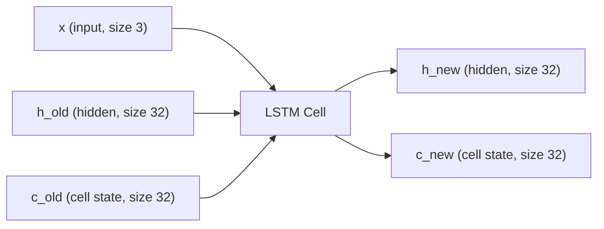
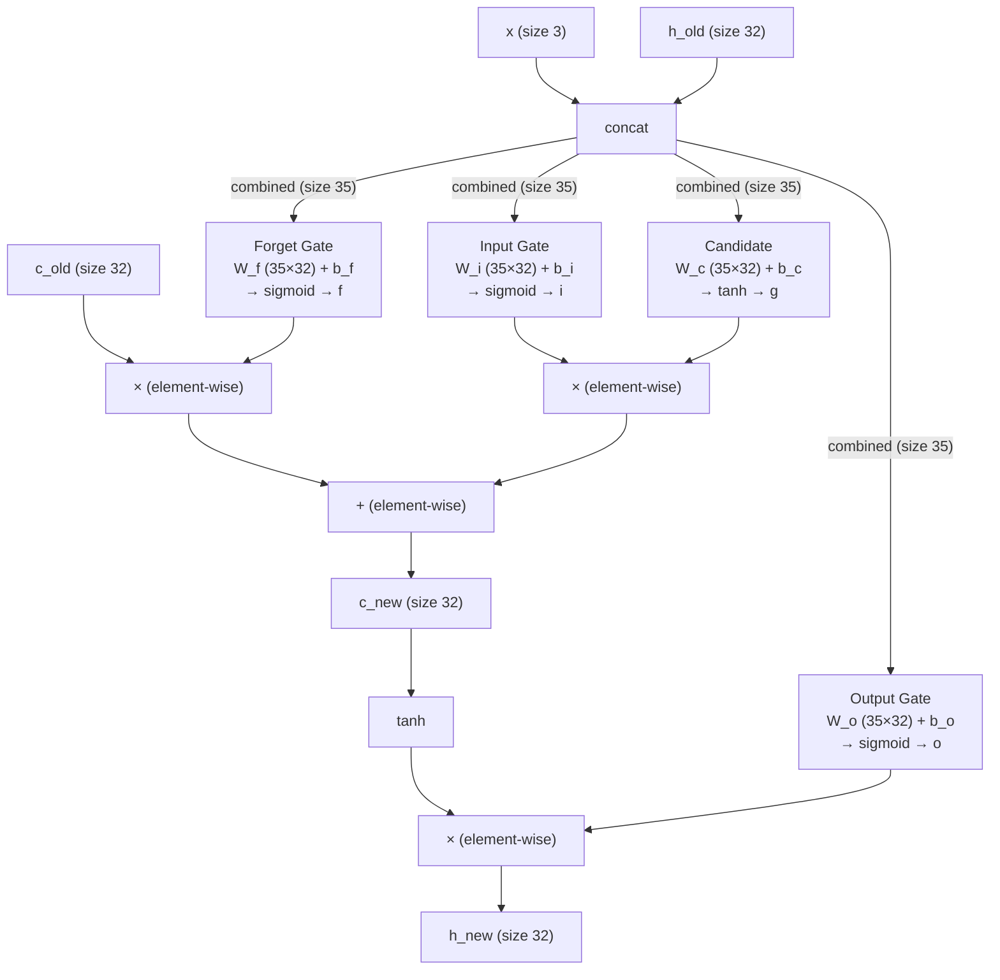

# LSTM Cell — Visual Guide

## The Big Picture

An LSTM cell takes 3 inputs and produces 2 outputs:



- **x**: current observation (T-Maze: 3 floats — signal, position, at_junction)
- **h_old**: previous hidden state (your "working memory", size 32)
- **c_old**: previous cell state (your "long-term memory", size 32)
- **h_new**: updated hidden state → used for action decisions
- **c_new**: updated cell state → carried to next step

## Inside the Cell



## The Four Gates (Step by Step)

### Step 1: Concatenate input and hidden state

```
combined = [x, h_old] = [obs₀, obs₁, obs₂, h₀, h₁, ..., h₃₁]
                          ←── 3 ──→   ←────── 32 ──────→
                          = size 35
```

### Step 2: Compute the four gates

Each gate is: `sigmoid(W @ combined + b)` or `tanh(W @ combined + b)`

| Gate | Formula | Output range | Purpose |
|------|---------|-------------|---------|
| **Forget (f)** | sigmoid(W_f @ combined + b_f) | 0 to 1 | "How much old memory to keep" |
| **Input (i)** | sigmoid(W_i @ combined + b_i) | 0 to 1 | "How much new info to write" |
| **Candidate (g)** | tanh(W_c @ combined + b_c) | -1 to 1 | "What new info to potentially write" |
| **Output (o)** | sigmoid(W_o @ combined + b_o) | 0 to 1 | "How much memory to expose" |

### Step 3: Update cell state (long-term memory)

```
c_new = f * c_old + i * g
        ────┬────   ──┬──
        "keep this    "add this
         from old      new info"
         memory"
```

This is the **additive update** that prevents vanishing gradients.

### Step 4: Compute new hidden state (working memory)

```
h_new = o * tanh(c_new)
        ─┬─  ────┬────
    "how much    "what's in
     to reveal"   memory"
```

## Dimensions for T-Maze

| Tensor | Shape | Total numbers | What it is |
|--------|-------|--------------|------------|
| x (input) | (3,) | 3 | observation |
| h (hidden) | (32,) | 32 | hidden state |
| c (cell) | (32,) | 32 | cell state |
| combined | (35,) | 35 | [x, h] concatenated |
| W_f, W_i, W_c, W_o | (35, 32) each | 1,120 each | gate weight matrices |
| b_f, b_i, b_c, b_o | (32,) each | 32 each | gate biases |
| f, i, g, o | (32,) each | 32 each | gate outputs |

**Total trainable parameters**: 4 × (35 × 32 + 32) = **4,608**

## Efficient Implementation Trick

Instead of 4 separate matrix multiplies, do one big one and split:

```
W = (35, 128)          # one big matrix (128 = 4 × 32)
b = (128,)             # one big bias

all_gates = W @ combined + b     # (128,) — one matmul
f, i, g, o = split into 4 chunks of 32

f = sigmoid(f)
i = sigmoid(i)
g = tanh(g)
o = sigmoid(o)
```

Same result, one matrix multiply instead of four. GPUs love big matmuls.

## T-Maze Example Walkthrough

```
Step 0: x = [-1, 0, 0]  (signal=LEFT, pos=0, not at junction)
        h = [0, 0, ..., 0]  (fresh start)
        c = [0, 0, ..., 0]  (empty memory)

        → Gates compute → input gate fires →
        → c_new stores "signal was LEFT" somewhere in its 32 dimensions
        → h_new reflects current state

Step 1-7: x = [0, pos, 0]  (no signal, walking)
        → forget gate stays ~1 (don't erase memory!)
        → input gate stays ~0 (nothing important to write)
        → c carries "LEFT" signal unchanged through 7 steps
        → h reflects boring corridor state

Step 8: x = [0, 8, 1]  (no signal, at junction!)
        → output gate fires (time to use memory!)
        → h_new exposes the stored "LEFT" signal
        → policy head reads h_new → picks action LEFT
        → reward +1!
```

The cell state `c` is the conveyor belt carrying "LEFT" from step 0 to step 8.
The forget gate keeps it alive. The output gate reveals it when needed.
